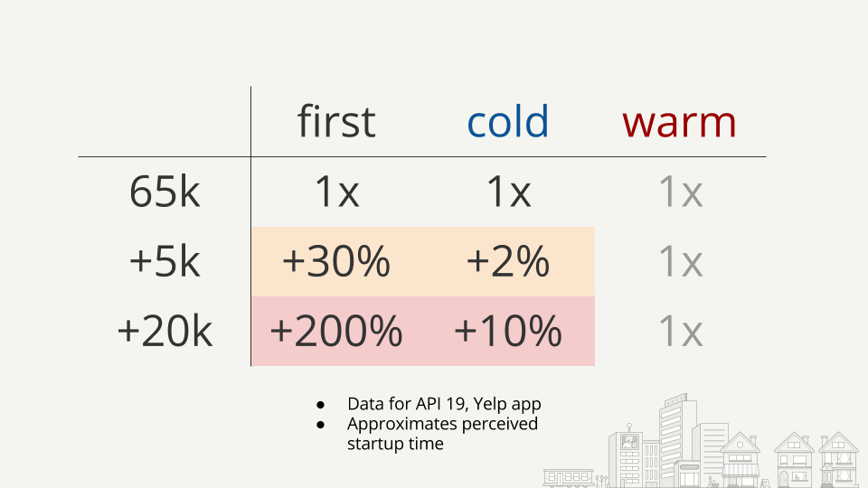

# MultiDex Notes

Note: if you’d like me to clarify on something, please open an issue 😀.

## Talk (DroidconSF March 2016):

* [Video](https://www.youtube.com/watch?v=skmOBriQ28E)
* [Slides](https://speakerdeck.com/tmelz/dexters-lab-understanding-and-experimenting-with-multidex-droidconsf-march-2016) via Speaker Deck

## TLDR on the startup performance impact of MultiDexing

## Resources for inspection APK methods

I recommend you do this to ensure that you’re not missing anything drastic (like a poorly configured proguard, for example). Loosely, about 50% of your total methods should belong to your package. Anything lower indicates not using proguard or having a proguard configuration that needs some love.

* [APK method count visualization](http://inloop.github.io/apk-method-count/) via inloop’s github

* Can also accomplish this with [ClassyShark](https://github.com/google/android-classyshark)

## Rough outline of experiments to improve the MultiDexing cost (from Talk)

1. Receive broadcast when app updated, perform the costly part of MultiDexing then; so when the user opens the app they don’t suffer this cost.
  * [ACTION_MY_PACKAGE_REPLACED documentation](http://developer.android.com/reference/android/content/Intent.html#ACTION_MY_PACKAGE_REPLACED)
  * Big win here, removes the "first start" cost entirely (except for new users; i.e. first starts after upgrades are always covered but the very first start after initial install won’t be).

2. Package out certain dependencies and "lazy load" them as desired.
  * See "[Lazy Loading Dex files](https://medium.com/@Macarse/lazy-loading-dex-files-d41f6f37df0e#.jk7bq9o0p)" by Carlos Sessa via Medium
  * Can potentially entirely avoid the need to "MultiDex" at startup time.

3. Using a modified ZipFile class and re-ordering the APK to put dex files in an expected place and remove the need to read more than the minimal amount of entries in the APK’s central directory.
  * For now the slides will be the best reference.

## Areas of potential future experimentation/optimization

1. As discussed in Groupon’s "[Android’s multidex slows down app startup](https://medium.com/groupon-eng/android-s-multidex-slows-down-app-startup-d9f10b46770f#.14kccojms)"; modifying the main dex list to include as many classes of the “startup flow” as possible would likely have benefits, as loading a class from a secondary dex (even after it has been added to the classpath) would involve reading it into memory first (I suspect).

2. Since the main dex file in general contains all the classes necessary for Application startup, you could possibly run MultiDex.install concurrently to Application#onCreate. As long as you ensure that you wait for the MultiDexing to complete before you proceed to starting an Activity, you should be fine.

3. …?

## MultiDexing issues: (didn't have time for this in the talk)

* com.android.dex.DexException: Too many classes in --main-dex-list, main dex capacity exceeded
  * No great reference for solving this currently, may post something in the future.

## Sources

* Dalvik
  * [Google I/O 2008: Dalvik Virtual Machine Internals](https://www.youtube.com/watch?v=ptjedOZEXPM)
  * [Dalvik bytecode reference](https://source.android.com/devices/tech/dalvik/dalvik-bytecode.html)

* Dex Files
  * [Dex Ed by Jesse Wilson](https://www.youtube.com/watch?v=v4Ewjq6r9XI)
  * [A deep dive into DEX file format](http://elinux.org/images/d/d9/A_deep_dive_into_dex_file_format--chiossi.pdf) by Rodrigo Chiossi
  * [Google Docs on Dex Format](https://source.android.com/devices/tech/dalvik/dex-format.html)
  * [Tool for inspecting Dex Files](https://github.com/swankjesse/dex/blob/master/dex/src/main/java/com/android/dex/Dex.java) by Jesse Wilson

* ART
  * [Google I/O 2014: The ART Runtime](https://www.youtube.com/watch?v=EBlTzQsUoOw)

* Commentary
  * [Early (2010) Google issue about dex method limit](https://code.google.com/p/android/issues/detail?id=7147#c6); includes commentary regarding the jumbo-string instruction addition as well as speculation on how Google would address this going forward.
  * [Live Q&A with Dan Bornstein, Creator of the Dalvik VM](https://www.youtube.com/watch?v=FO1Xe7bF2VY); a large portion of this was addressing the method limit.
  * [StackOverflow answer: the dex method limit is in the instruction set](http://stackoverflow.com/a/21492160)

* Source code:
  * MultiDex
    * git clone https://android.googlesource.com/platform/frameworks/multidex
    * [Viewable online](https://android.googlesource.com/platform/frameworks/multidex/) via android.googlesource.com
  * Dalvik code in android/platform/libcore
    * git clone https://android.googlesource.com/platform/libcore
    * [Viewable online](https://android.googlesource.com/platform/libcore/+/master/dalvik/src/main/java/dalvik/system/) via android.googlesource.com

* Misc
  * [Custom Class Loading in Dalvik](http://android-developers.blogspot.com/2011/07/custom-class-loading-in-dalvik.html); 2011 post by GDA Fred Chung--"MultiDexing” has always been possible!

## Other fun resources:

* [Methodscount.com](http://www.methodscount.com/) gives you an idea of how many methods common libraries add to your build

